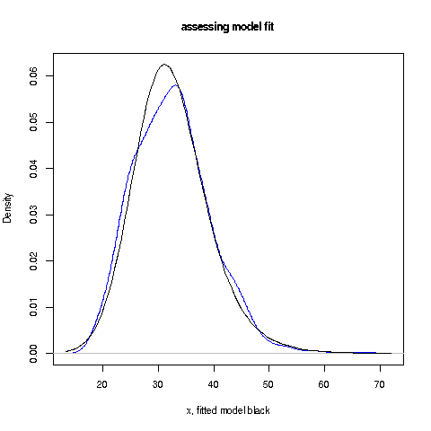

# The ex-normal distribution family: tutorial, fitting, and standard errors

I recently heard of a distribution family, *ex-normal* or *ex-gaussian*,
that is popular in psychology/cognitive science, especially for things
like reaction times.  I had not heard or it before, nor had other
statisticians whom I mentioned it to, so I started to look into it.
This little R package is the result.

*What is the ex-normal family?*

A random variable X with a distribution in this family is modeled at

X = V + W

where V and W are independent random variables having an exponential
distribution and a normal/Gaussian distribution, respectively.  

This makes it a 3-parameter distribution family: &mu; and
&sigma;<sup>2</sup> come from the normal component, and the mean &tau; for
the exponential.  As such, it offers a lot of modeling flexibility in
terms of different density shapes, which are unimodal but asymmetric.

*Interpretation:*

A number of interpretations, sometimes conflicting, have been given for
the V and W components of an ex-normal random variable.  For instance, 
a [Matske and Wagenmaker, *Psychonomic Bulletin and Review*, 200](https://link.springer.com/content/pdf/10.3758/PBR.16.5.798.pdf) write:

> Originally, the ex-Gaussian distribution was thought to represent the
> durations of two successive components of cognitive processing. In
> particular, Hohle (1965) suggested that the exponential component
> represents “the decision and perceptual portion of an RT [i.e. a
> reaction time],” whereas the Gaussian component reflects “the time
> required for orga- nization and execution of the motor
> response”...[But] there is disagreement as to which processing
> mechanism should be attributed to the two ex-Gaussian components.
> McGill (1963) and McGill and Gibbon (1965), for example, suggested
> that residual motor latency corresponds to the exponential component
> of the ex- Gaussian, not to the Gaussian component. This
> interpretation is diametrically opposed to that of Hohle (1965).
> Second, the rationale underlying Hohle’s (1965) inter- pretation of
> the two ex-Gaussian components has been criticized...

From a statistical point, though, there are different problems, to be
addressed now:

*Failure to perform standard statistical anaysis*

Saul Steinberg of the University of Pennsylvania 
[has written](https://www.sas.upenn.edu/~saul/exgauss.stages.pdf)

> In a sample of 15 of the papers published during 2012 and 2013 in which
> estimated parameters from fits of the ex-Gaussian distribution to RT
> data were reported, I found only two that reported statistical tests of
> goodness of fit.

In addition, many papers apparently don't even construct confidence
intervals or perform hypothesis tests regarding the three distributional
parameters.  This is surprising, as such statistical inference is
usually the stock and trade of social science research.

The obstacle seems to be lack of standard errors for the parameters. The
[Wikipedia
entry](https://en.wikipedia.org/wiki/Exponentially_modified_Gaussian_distribution#Confidence_intervals)
says "There are currently no published tables available for significance
testing with this distribution," but approximate values would not be
hard to obtain.  The parameters are generally estimated by the Method of
Moments or the Method of Maximum Likelihood, both of which are amenable
to determining large-sample standard errors.  Or, as we do here in this
package, one may use the [jackknife](https://math.montana.edu/jobo/thainp/jack.pdf).

As for goodness of fit assessment, many of us regard significance
testing of any kind to be [poor statistical
practice.](https://github.com/matloff/regtools/blob/master/inst/NoPVals.md)
In this package, then we have software to do informal visual assessment.
Specifically, our plot function graphs a nonparametric estimate of the
density, superimposed on the graph of the ex-normal fit.

*Example:*

``` r
> library(exNorm)
> data(BMI)
> fitMME <- exNormMMEftn(mass)  # MM estimates
> fitMME  # estimates and standard errors
$Tjack
       mu       sig       tau 
27.782884  5.142875  4.674580 

$SEs
       mu       sig       tau 
0.5242160 0.2917731 0.5065840 a
> plotFit(mass,fitMME)


```



